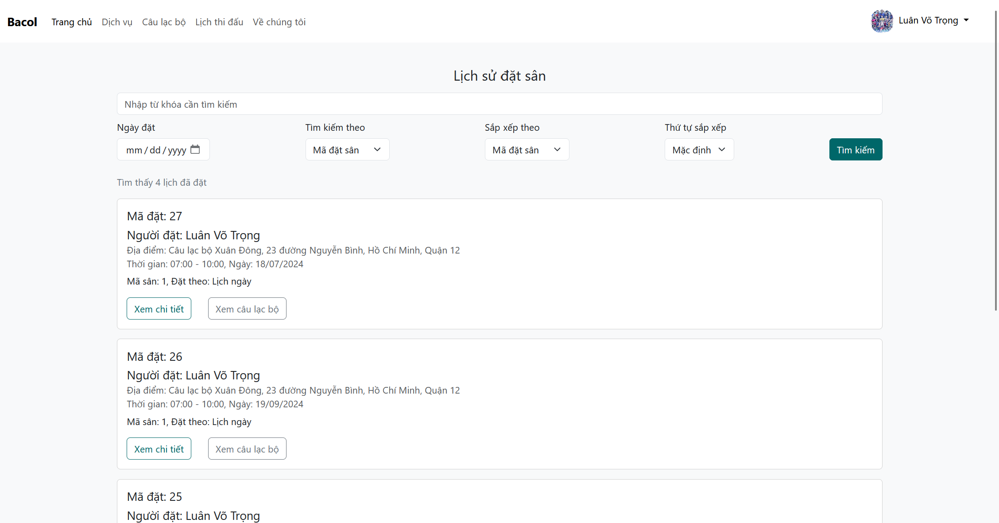

# Badminton Court Booking Platform

## Getting Started

To get started with this project, follow these steps:

### Prerequisites

- [.NET Core SDK](https://dotnet.microsoft.com/download)
- [Microsoft SQL Server](https://www.microsoft.com/en-us/sql-server/sql-server-downloads)
- [Entity Framework Core](https://docs.microsoft.com/en-us/ef/core/)
- [Git](https://git-scm.com/)

### Installation

1. Clone the repository:

   ```bash
   git clone https://github.com/votrongluan/badminton-booking-razor-page
   cd badminton-booking-razor-page
   ```

2. Install dependencies:
   ```bash
   dotnet restore
   ```

### Setting Up the Database

1. Update the `appsettings.json` file (RazorWebApp folder) with your database connection string:

   ```json
   {
     "ConnectionStrings": {
       "DefaultConnectionString": "YourConnectionStringHere"
     }
   }
   ```

   **Please do not commit any changes in `appsettings.json`**

2. Run the `DatabaseScript.sql` in `Others` folder

## Usage

### Running the Application

1. Run the application in `RazorWebApp` folder:

   ```bash
   dotnet run
   ```

2. Navigate to `https://localhost:5072` in your web browser to see the application in action.

### Examples

Here are some example usages of the application:

- View all clubs
- Book a court
- View your book history

## Screenshots

<div style="text-align: center;">
    
    <p><em>Screenshot 1</em></p>
</div>

<hr/>
<br/>

<div style="text-align: center;">
    
    <p><em>Screenshot 2</em></p>
</div>

<hr/>
<br/>

<div style="text-align: center;">
    
    <p><em>Screenshot 3</em></p>
</div>

<hr/>
<br/>

<div style="text-align: center;">
    
    <p><em>Screenshot 4</em></p>
</div>

<hr/>
<br/>

<div style="text-align: center;">
    
    <p><em>Screenshot 5</em></p>
</div>

<hr/>
<br/>

## Authors and Acknowledgment

Thanks to all the contributors who have helped develop this project.

## License

This project is licensed under the MIT License - see the [LICENSE](LICENSE) file for details.

## Project Status

**Not Actively Maintained**

Thank you for your interest in this project! Unfortunately, we regret to inform you that this project is no longer actively maintained. While contributions are always welcome, we recommend checking out other active projects or exploring alternative solutions.

If you have any questions or need further assistance, feel free to reach out. We appreciate your understanding and support!
